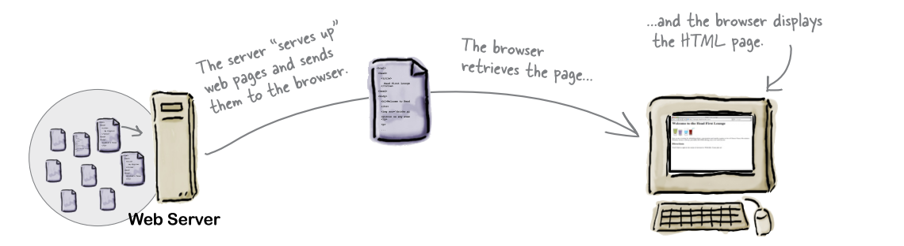
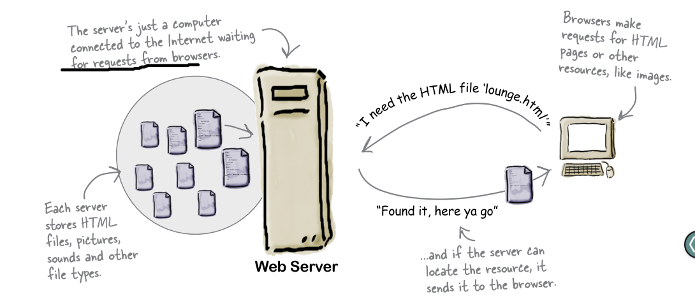

# Head First HTML&CSS
 

## Broad Summary

- [Web server vs Web browser](#web-server-vs-web-browser)


## [QAS](#QAS)


## Web server vs Web browser

- __Web servers__
 
   Web servers have a full-time job on the Internet, tirelessly waiting for requests from web browsers. What kinds of requests? Requests for web pages, images, sounds, or maybe
   even a video. When a server gets a request for any of these resources, the server finds the resource, and then sends it back to the browser.

   

- __Web Browser__

	You already know how a browser works: you’re surfing around the Web and you click on a link to visit a page. That click causes your browser to request an HTML page from a web
	server, retrieve it, and display the page in your browser window,
   


### QAS

- ***Comments in Html?***

```html

	<!-- Here's the beginning of the lounge content -->

```

- *The HTML for the Head First Lounge has all kinds of indentation and spacing, and yet I don’t see that when it is displayed in the browser. How come?*

	Browsersignore tabs, returns, and most spaces in HTML documents. Instead, they rely on the markup to determine where line and paragraph breaks occur. Tabs are onlyfor us to make thedocument more readable.


- *Why do I need the `<html>` tag? Isn’t it obvious this is an HTML document?*

	To tell the browser your document is actually HTML. While some browsers will forgive you if you omit it, some won’t.
